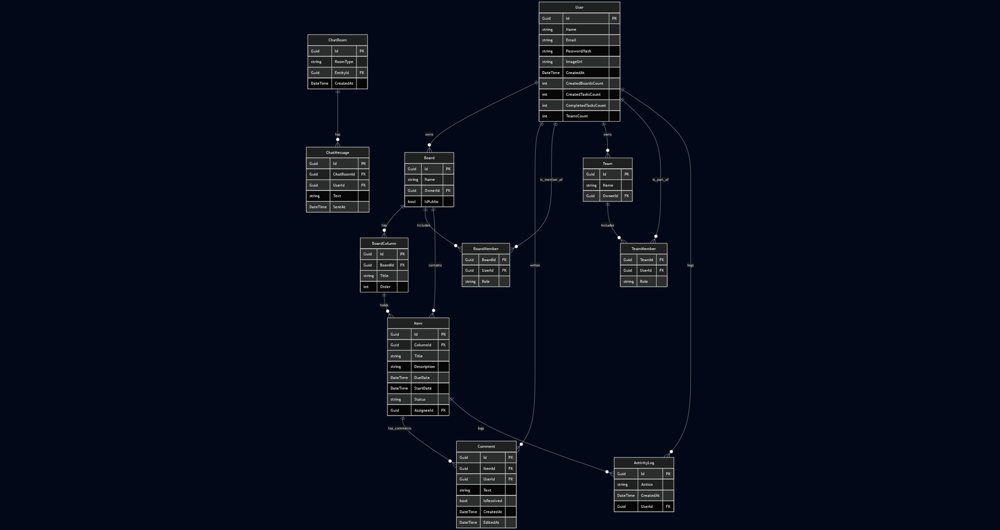

# 🧠 Simpled – Gestión colaborativa de ideas y tareas

> 🚀 *Clon inspirado en Trello / Notion con funcionalidades de organización en tiempo real y control de acceso por roles.*

[](https://dotnet.microsoft.com/)  
[](https://react.dev/)  
[](https://sqlite.org/)  
[](https://learn.microsoft.com/en-us/aspnet/core/signalr/introduction)

---

## 📄 Índice

- [🔧 Cómo clonar y ejecutar](#-cómo-clonar-y-ejecutar)
- [🏛️ Arquitectura y tecnologías](#-arquitectura-y-tecnologías)
- [📁 Estructura del proyecto](#-estructura-del-proyecto)
- [🌐 Endpoints principales](#-endpoints-principales)
- [🗃️ Base de datos y E/R](#-base-de-datos-y-er)
- [🚀 Despliegue](#-despliegue)
- [📚 Referencias y bitácora](#-referencias-y-bitácora)
- [📺 Vídeo de presentación](#-vídeo-de-presentación)
- [📌 Enlace al anteproyecto](#-enlace-al-anteproyecto)

---

## 🔧 Cómo clonar y ejecutar

```bash
git clone https://github.com/usuario/simpled.git
cd simpled
```

### ▶ Backend (.NET 8)

```bash
cd backend/Simpled
dotnet restore
dotnet run
```

> ⚠ Es obligatorio tener instalado el **.NET 8 SDK**.

### ▶ Frontend (React / Next.js)

```bash
cd frontend
npm install
npm run dev
```

> ⚠ Es obligatorio tener instalado **Node.js (LTS)**.

---

## 🏛️ Arquitectura y tecnologías

🧱 **Backend (C# / .NET 8)**

- ASP.NET Core Web API
- EF Core + SQLite
- Autenticación con JWT
- SignalR para tiempo real
- Validaciones con FluentValidation

🎨 **Frontend (React / Next.js)**

- Rutas protegidas y navegación con React Router o Next.js routing
- Axios o Fetch API para conectar con el backend
- Componentes reutilizables con Tailwind / Bootstrap / Material UI

🛠️ **DevOps / Infraestructura**

- Repositorio privado en GitHub
- Despliegue en Vercel / Monster.ASP / AWS
- Bitácora de tareas y documentación en Notion

---

## 📁 Estructura del proyecto

```
Simpled/
├── backend/
│   └── Simpled/               # Proyecto ASP.NET Core
│       ├── Controllers/       # Endpoints de la API REST
│       ├── Models/            # Entidades y relaciones
│       ├── Dtos/              # DTOs para entrada/salida
│       ├── Data/              # DbContext y configuración
│       ├── Hubs/              # SignalR real-time
│       └── Program.cs         # Configuración general
├── frontend/
│   └── (React/Next app)       # Interfaz de usuario
├── docs/
│   ├── presentacion.pdf       # Presentación para exposición
│   └── Simpled_ER.png         # Diagrama E/R
│   └── Bitacora.md            # Registro diario de tareas
└── README.md                  # Este archivo
```

---

## 🌐 Endpoints principales

### 🔐 Autenticación
- `POST /api/auth/login` → Login y obtención de token JWT

### 👥 Usuarios
- `GET /api/users` → Listado de usuarios (admin)
- `POST /api/users/register` → Registro de nuevo usuario

### 🧩 Boards
- `GET /api/boards` → Listar tableros
- `POST /api/boards` → Crear tablero (requiere OwnerId)

### 📦 Columnas
- `GET /api/columns` → Listar columnas por board
- `POST /api/columns` → Crear columna

### 🗂 Items
- `GET /api/items` → Listar tareas
- `POST /api/items` → Crear tarea
- `POST /api/items/{id}/upload` → Subir archivo

---

## 🗃️ Base de datos y E/R




---

## 🚀 Despliegue

🔗 **Aplicación en producción**: *(pendiente)*  
🔗 **Landing page**: *(pendiente)*  
🔗 **Diseño prototipo (Figma)**: *(pendiente)*  

---

## 📚 Referencias y bitácora

📘 **Bibliografía:**

- [Documentación oficial ASP.NET Core 8](https://learn.microsoft.com/aspnet/core)
- [React docs](https://react.dev/)
- EF Core, FluentValidation, SignalR, etc.

📒 **Bitácora** → [bitacora.md](docs/bitacora.md)

---

## 📺 Vídeo de presentación

🔗 Se subirá en YouTube con duración máxima de **10 minutos**, donde se muestre:

- Haz clic en la imagen para ir al video.

[](https://youtu.be/7ciRupxl6A4)

---

## 📌 Enlace al anteproyecto

🔗 [📄 Ver anteproyecto en Notion](https://steady-rock-b8f.notion.site/AnteProyecto-Simpled-1bea38c3af458040a867de299d2016fb?pvs=74)

---

## 👥 Autores

- **Adrián Jiménez Santiago**  
- **Elías Robles Ruiz**

> Proyecto Final de Grado del Ciclo Formativo de Desarrollo de Aplicaciones Web

---
